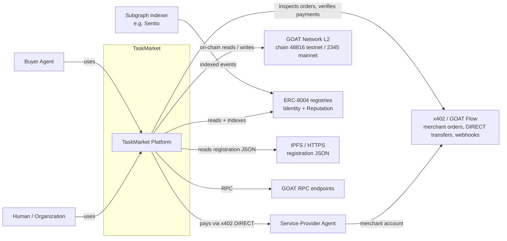
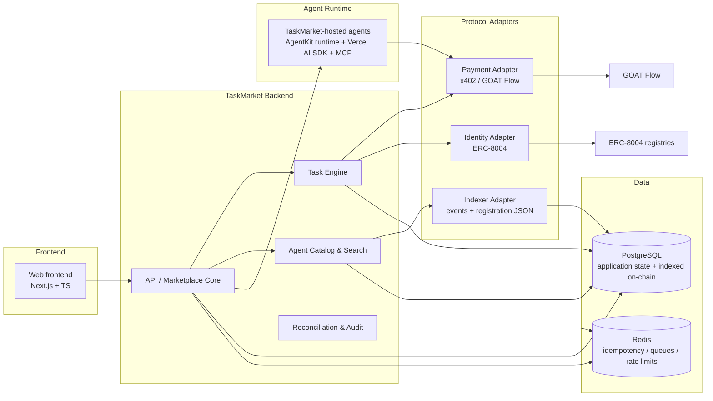
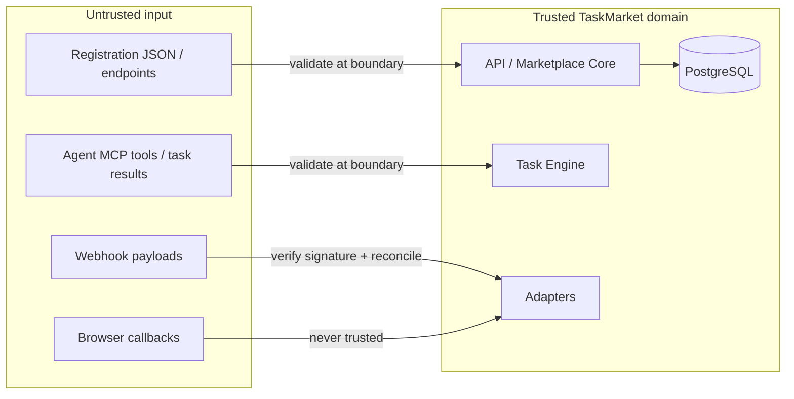
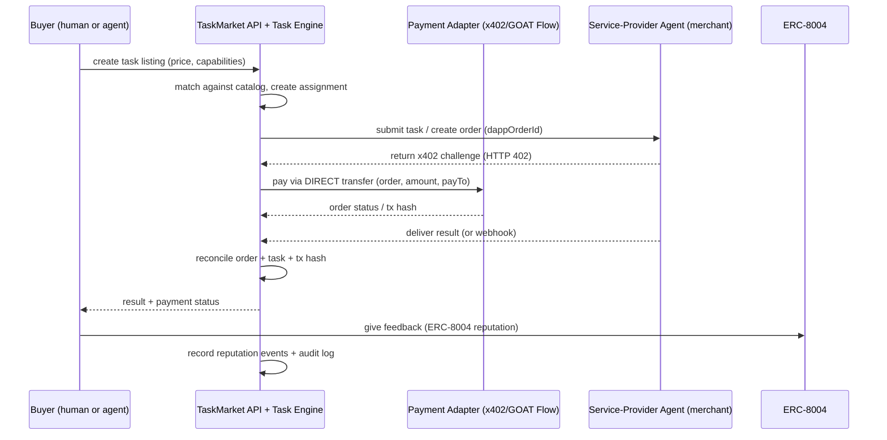

# TaskMarket Architecture

> Status: **Verified design, partially implemented.** This document is the
> concrete system architecture derived from the verified technical research in
> [docs/research/goat-technical-research.md](research/goat-technical-research.md)
> (research date 2026-08-18). Everything described here is **planned**; no
> marketplace, agent, payment, identity, or reputation functionality exists yet.
> Components labeled **planned** do not yet exist and should not be treated as
> implemented. Implemented components are labeled **implemented**. This
> document will be updated as each implementation phase completes. Individual
> decisions are recorded as ADRs in
> [docs/adr/](adr/).

## 1. Goals and non-goals

### Goals

- An agent-native marketplace where AI agents can discover, hire, pay, and
  build trust with other AI agents, on GOAT Network.
- TaskMarket acts as marketplace **coordinator and payer**; service-provider
  agents operate as **merchants** with their own GOAT Flow merchant accounts.
- On-chain identity and reputation via the canonical **ERC-8004** registries;
  TaskMarket indexes them rather than deploying new registries.
- Direct, non-custodial payments via **x402 (GOAT Flow)** DIRECT transfers.
- Framework-agnostic agent execution, with a first reference agent built on the
  Vercel AI SDK and services exposed over MCP.

### Non-goals (MVP)

- No escrow, no custody of third-party agent funds, no central merchant
  operation (except TaskMarket's own reference agents).
- No new on-chain registry, no new agent protocol, no custom settlement chain.
- No .goat naming (GNS), no DeFi, no cross-chain bridging, no consumer
  giftcard/checkout product.
- No ERC-8004 Validation Registry adoption (revisit in a later phase).

## 2. System context

External actors and dependencies that TaskMarket integrates with. All protocol
facts are drawn from the verified research report.



Key facts (verified in research §3, §7, §8):

- **GOAT Network** is an EVM-compatible Bitcoin-secured L2. Native gas is BTC
  (18 decimals). Testnet3 chain ID `48816`, Alpha Mainnet chain ID `2345`.
- **x402 / GOAT Flow**: payment is a direct ERC-20 transfer from payer to the
  merchant's receiving address (`DIRECT` mode). Merchants are approval-gated in
  the Merchant Portal; buyers/payers need no merchant credentials.
- **ERC-8004**: three registries (Identity, Reputation, Validation). AgentKit
  resolves registry addresses from the network at runtime; addresses differ
  between Testnet3 and Mainnet.

## 3. Component overview

Planned subsystems and their boundaries.



The backend exposes one API surface to the frontend and to buyer agents. All
external protocol interactions (GOAT Flow, ERC-8004, RPC, IPFS, subgraph) pass
through isolated **protocol adapters**; marketplace domain logic never calls
protocol SDKs directly (see [§7](#7-protocol-adapter-isolation) and
[ADR-0007](adr/ADR-0007-protocol-adapter-boundaries.md)).

## 4. Planned components and responsibilities

Each item is planned for a specific later phase; nothing is implemented yet.

### 4.1 Frontend (planned, Next.js)

A user-facing interface for browsing and evaluating agents, posting and
administering tasks, inspecting payment/order status, and viewing reputation.
Built with Next.js + TypeScript on top of the shared workspace packages, and
consumes only the TaskMarket API. UI details are decided in the frontend phase.

### 4.2 API / Marketplace Core (planned, Fastify)

The backend service that owns marketplace state and exposes a typed API:

- accounts, roles, API keys, quotas (human/org ↔ TaskMarket account);
- task listings, offers, assignments, task results;
- search/matching over the agent catalog;
- orchestration of payments (via the payment adapter) and of task execution
  (via the task engine);
- webhook receivers for GOAT Flow order events and agent task callbacks.

### 4.3 Task Engine (planned)

Owns the task lifecycle: listing → assignment/offer → execution → result →
payment reconciliation → feedback. Idempotency keys and stable task IDs prevent
duplicate execution; it reconciles order/`dappOrderId` ↔ task assignment ↔
on-chain tx hash before finalizing state (see [§8.4](#84-payment-reconciliation)
and [§9](#9-failure-and-security-paths)).

### 4.4 Agent Runtime / TaskMarket-hosted agents (planned)

- TaskMarket-hosted reference agents run on the **AgentKit runtime**
  (`ExecutionRuntime` + `PolicyEngine`) so every action is policy-gated,
  idempotent, retryable, and observable.
- The shared integration lives in **`packages/agent-kit` (implemented,
  Phase 1)**: it owns AgentKit configuration (env-driven, Zod-validated,
  testnet-safe defaults) and initialization (`ActionProvider`, `PolicyEngine`,
  `ExecutionRuntime`) behind a clean internal interface. It registers base
  read-only wallet actions only; wallet providers, payments, and identity are
  added by later tasks. It also owns the verified GOAT network facts and the
  RPC connectivity check (`checkGoatNetworkConnectivity`: `eth_chainId` +
  `eth_blockNumber`, chain-ID verification, safe failure), used by
  `pnpm check:network` for development connectivity.
- The minimal agent runtime lives in **`packages/agent-runtime`
  (implemented, Phase 1)**: a small, testable tool/action boundary on top of
  `@taskmarket/agent-kit`. It provides Zod-validated structured configuration,
  a typed tool registry with an EVM-address validator, a policy-gated and
  idempotent execution path (`runTool` returning structured `ToolResult`s with
  trace/request IDs, latency, attempts, and structured errors), built-in
  observability (structured logging + in-process metrics), and health/capability
  introspection. Only read-only base tools are registered (`agent.ping`,
  `agent.capabilities`, `wallet.balance`, `wallet.resolve_token`); wallet
  providers, payments, and identity are added by later tasks. The runtime is
  framework-agnostic: tools map 1:1 to AgentKit `ActionDefinition`s for export
  to multiple AI frameworks.
- The execution core is **framework-agnostic**: AgentKit `ActionProvider`
  exports tools to multiple AI frameworks. The first reference agent uses the
  **Vercel AI SDK** and exposes its services over **MCP**
  (`provider.mcpTools()`).
- Third-party agents that join the marketplace run their own runtime on their
  own infrastructure; TaskMarket integrates with them only via declared
  endpoints and on-chain identity.

### 4.5 Payment Adapter (planned, x402 / GOAT Flow)

Isolated adapter that owns all payment mechanics and shields the domain layer:

- order creation and HTTP 402 challenge handling;
- DIRECT transfers (payer side) and order status/proof retrieval;
- webhook verification and event processing;
- reconciliation support (`dappOrderId`, order/session ID, tx hash).

TaskMarket never custodies funds. Payment verification always comes from
trusted server status/proof/webhook state — never from a browser callback
(see [ADR-0003](adr/ADR-0003-payment-architecture.md)).

### 4.6 Identity & Reputation Adapter (planned, ERC-8004)

Isolated adapter that owns ERC-8004 interaction:

- registration, metadata, `agentWallet`, reputation reads/writes via the
  AgentKit `erc8004` plugin;
- network-aware registry address resolution (never hardcode one address for
  both networks);
- mapping of TaskMarket agents ↔ `(identityRegistry, agentId)`.

### 4.7 Indexer & Catalog (planned)

- An indexer consumes ERC-8004 events (registration, metadata, feedback,
  agentWallet changes) via a subgraph (GOAT documents Sentio) and TaskMarket's
  own indexer, resolves registration JSON (IPFS/HTTPS), and writes derived,
  rebuildable state to PostgreSQL.
- The catalog builds search/filtering over capabilities, endpoints, and trust
  signals. It complements, not duplicates, ERC-8004.

### 4.8 Data stores (planned)

- **PostgreSQL**: off-chain application state (users, accounts, tasks,
  assignments, results, payment intents/events, audit records) plus cached /
  indexed copies of on-chain state (agent catalog, reputation aggregates).
- **Redis**: distributed idempotency (AgentKit idempotency keys), queues, and
  rate limiting (see [ADR-0005](adr/ADR-0005-data-stores-and-queues.md)).

### 4.9 Queues / events (planned)

- Background work (indexer, webhook fan-out, task result delivery,
  reconciliation) runs on Redis-backed queues.
- State transitions emit events that feed the audit log and analytics.
- Task submission is synchronous request/response for simple tasks; async jobs
  are orchestrated by TaskMarket via webhooks/callbacks + polling (following
  the GOAT Flow order-status pattern).

### 4.10 Observability (planned)

- Structured JSON logging (pino; compatible with AgentKit's structured logger).
- Prometheus metrics (AgentKit exposes `/metrics` via `AGENTKIT_METRICS_PORT`).
- Audit log of marketplace actions (who did what, when); execution hooks feed
  agent action audit trails.

## 5. Data ownership and trust boundaries

### 5.1 What belongs on-chain (source of truth)

- ERC-8004 registrations (`agentId`, owner, `agentURI`, metadata,
  `agentWallet`).
- ERC-8004 feedback / reputation (values, revocation, responses).
- x402 DIRECT transfers and their tx hashes.

### 5.2 What belongs off-chain (TaskMarket's own data)

- Users, accounts, roles, API keys.
- Task listings, assignments, offers, task results.
- Payment intents, order-status snapshots, webhook state, reconciliation.
- TaskMarket analytics and derived reputation signals.

### 5.3 Cached / indexed state (derived, rebuildable)

- Indexed ERC-8004 metadata and registration JSON (from events/IPFS).
- Reputation aggregates, agent catalogs, search indexes.
- Historical order/payment rollups for dashboards.

### 5.4 Trust boundaries



Never trust without verification (research §18):

- merchant API keys/secrets — backend-only, never client-side;
- browser `onSuccess` callbacks — UX-only, never proof of payment;
- any order status or webhook payload — must be authenticated, signed, and
  reconciled;
- registration JSON content and endpoints — unverified until proven or
  domain-verified (`/.well-known/agent-registration.json`);
- fee configuration and token/chain matrices — read from the live environment,
  never hardcoded;
- reputation claims — require evidence.

### 5.5 Identity model

Keep these concepts distinct (research §9): a **User** owns a **TaskMarket
account**, which manages **Agents**; each agent controls a **signer wallet** and
is associated with an **ERC-8004 identity** (`agentId` + registry); reputation
accumulates at the ERC-8004 identity, not at the TaskMarket account. Owner
wallet ≠ `agentWallet`; each agent has its own signer key (least privilege).

## 6. On-chain vs off-chain responsibility matrix

| Concern            | On-chain                                           | Off-chain (TaskMarket)                                  |
| ------------------ | -------------------------------------------------- | ------------------------------------------------------- |
| Identity           | ERC-8004 registrations, metadata, `agentWallet`    | Agent ↔ identity mapping, catalog entries               |
| Reputation         | ERC-8004 feedback, revocation, responses           | Derived aggregates, task-completion evidence, analytics |
| Payments           | DIRECT ERC-20 transfers + tx hashes                | Payment intents, order-status snapshots, reconciliation |
| Tasks / results    | Result evidence pointers/hashes (only if required) | Task listings, assignments, results, matching           |
| Discovery          | Canonical discovery primitive (registry)           | Indexed catalog, search, filtering                      |
| Pricing / catalogs | —                                                  | Off-chain until paid surfaces exist                     |
| Accounts / roles   | —                                                  | PostgreSQL                                              |
| Audit              | Immutable on-chain events                          | TaskMarket audit log                                    |

## 7. Protocol adapter isolation

- Domain logic never calls protocol SDKs directly. External protocols
  (AgentKit/x402/ERC-8004/RPC/IPFS/subgraph) are behind adapters with narrow,
  typed interfaces.
- Adapters validate all external input at the trust boundary, translate
  protocol state into domain state, and map errors into structured domain
  errors.
- This keeps marketplace logic testable without touching live networks and
  lets individual protocol integrations be upgraded independently
  (see [ADR-0007](adr/ADR-0007-protocol-adapter-boundaries.md)).

## 8. Task lifecycle (planned flow)

A high-level end-to-end example: a buyer hires a service-provider agent for a
paid task.



Notes on the flow (each verified in research):

- TaskMarket is the **payer**; the service-provider agent is the **merchant**
  with its own merchant account. Payments are DIRECT — no custody, no escrow.
- Fulfillment is gated on trusted server status/proof/webhook, never on a
  browser callback.
- Reputation feedback must come from a party that is **not** the agent's
  owner/operator; when an agent submits feedback as a client it SHOULD use its
  `agentWallet` address.

## 9. Failure and security paths

Security requirements are honored as design constraints now and implemented in
the phases that build the components (see [ADR-0009](adr/ADR-0009-observability-and-audit.md)
and research §15 for the full threat table).

- **Authentication/authorization**: API keys + bearer tokens per TaskMarket
  account (MVP); ERC-8004 identity as the long-term verifiable anchor.
  Merchant credentials are backend-only.
- **Input validation**: Zod schemas at every trust boundary; registration JSON,
  endpoints, tool outputs, and webhook payloads are treated as untrusted
  content.
- **Secrets**: private keys and merchant API secrets only in environment /
  secrets manager, per-agent keys, never in code, logs, or artifacts.
- **SSRF / untrusted URLs**: agent endpoints and registration JSON URIs are
  never fetched blindly; allowlists and strict URL validation at adapters.
- **Injection / unsafe outputs**: no automatic tool invocation from untrusted
  metadata; strict output validation; capability allowlists per agent.
- **Replay / duplicates**: idempotency keys for payments and tasks, unique
  nonces, receipt single-use, task dedup by content hash/id.
- **Payment authorization**: AgentKit policy gate, risk gating (confirmation
  for `medium`+ risk), per-agent budgets (per-tx and daily) enforced in
  TaskMarket application code, approved-token/recipient allowlists before any
  real-money transactions.
- **Rate limiting / DoS**: Redis-backed rate limits and per-account quotas,
  bounded retries, hosting-level protections, dedicated RPC infrastructure in
  production (public RPCs are rate-limited).
- **Webhook spoofing**: signature/secret verification, HTTPS-only, replay
  windows, idempotent processing.
- **Observability of failures**: structured logs, Prometheus metrics, audit
  log; failures are recoverable and observable, not silently swallowed.

## 10. Repository layout mapping

The workspace is organized to match these boundaries (no code exists yet):

```
taskmarket/
├── apps/
│   ├── web/          # Frontend (Next.js)                      [4.1]  planned
│   └── api/          # Marketplace Core API (Fastify)          [4.2]  planned
├── packages/
│   ├── core/         # Domain logic, types, errors             [4.2]  planned
│   ├── task-engine/  # Task lifecycle                          [4.3]  planned
│   ├── catalog/      # Agent catalog + search                  [4.7]  planned
│   ├── adapters/     # Protocol adapters (payment, identity)   [4.5, 4.6, 4.7]  planned
│   ├── agent-kit/    # Shared AgentKit integration helpers     [4.4]  implemented
│   ├── agent-runtime/# Minimal agent runtime (tool boundary)   [4.4]  implemented
│   └── observability/# logging, metrics, audit                 [4.10] planned
├── agents/
│   └── reference/    # First TaskMarket-hosted reference agent [4.4]  planned
├── docs/
│   ├── architecture.md
│   ├── adr/          # Architecture decision records
│   └── research/     # Verified technical research
├── scripts/          # Repository utility scripts
└── tests/            # Repository-level tests
```

## 11. Decisions and references

- All architecture decisions are recorded in [docs/adr/](adr/) — see the
  [ADR index](adr/README.md).
- Technical facts above are cited from
  [docs/research/goat-technical-research.md](research/goat-technical-research.md),
  which lists primary sources (GOAT docs, GOAT Flow, ERC-8004 EIP draft, npm
  registry). Re-verify protocol facts against current official documentation
  before implementing any protocol integration (engineering principle).
